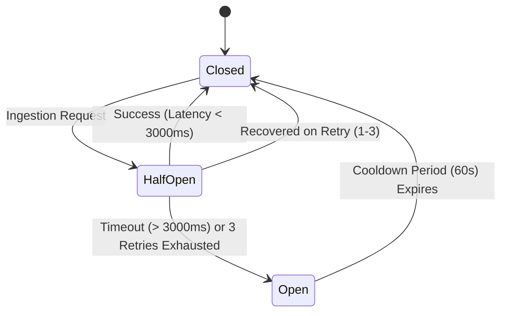

# Clinical MDT Interoperability & Integration Roadmap: DICOM, HL7 v2.5.1 & FHIR R4

## 1. Architectural Vision & Scope

The **Clinical MDT Evidence Timeline System** is designed to operate seamlessly within heterogeneous hospital IT landscapes, bridging Picture Archiving and Communication Systems (**PACS**), Laboratory Information Systems (**LIS**), Molecular Diagnostics Informatics, and Electronic Health Record (**EHR**) platforms.

This roadmap details the 4-phase technical evolution from current RESTful endpoints to full bi-directional enterprise interoperability conforming to **IHE (Integrating the Healthcare Enterprise)** profiles and **SMART on FHIR** standards.

```
+──────────────────────────────────────────────────────────────────────────────────────────+
|                               Hospital Ecosystem Ingestion                                |
|                                                                                          |
|    +-------------------+    +--------------------+    +-------------------------------+  |
|    |   Hospital PACS   |    |    Hospital LIS    |    |     Molecular Reference Lab   |  |
|    |  (Fuji / Sectra)  |    |  (CoPath / Sunquest) |  |   (Foundation / Tempus NGS)   |  |
|    +---------+---------+    +----------+---------+    +---------------+---------------+  |
|              |                         |                              |                  |
|     DICOMweb WADO-RS /         HL7 v2.5.1 ORU^R01 /           FHIR R4 DiagnosticReport/  |
|     DIMSE C-STORE / STOW-RS    OML^O21 Specimen Feed          Genomic Variant JSON       |
|              |                         |                              |                  |
|              +─────────────────────────┼──────────────────────────────+                  |
|                                        |                                                 |
|                                        v                                                 |
|    +────────────────────────────────────────────────────────────────────────────────+    |
|    |           Clinical MDT Evidence Ingestion Gateway & Staleness Engine           |    |
|    |                                                                                |    |
|    |  • Preamble Validation (DICM)    • Accession De-duplication                    |    |
|    |  • Exponential Backoff & Retry   • Circuit Breaker (Timeout SLA: 3000ms)       |    |
|    |  • Specimen Lineage Barcode Sync • Freshness State Machine (Fresh/Stale/Super) |    |
|    +───────────────────────────────────┬────────────────────────────────────────────+    |
+────────────────────────────────────────┼─────────────────────────────────────────────────+
                                         |
               +─────────────────────────┴─────────────────────────+
               |                                                   |
               v                                                   v
   [ Chronological MDT Timeline ]                      [ Immutable Clinical Audit Trail ]
```

---

## 2. Four-Phase Interoperability Roadmap

| Phase | Milestone | Protocols & Standards | Target Timeline | Key Clinical Deliverables |
|---|---|---|---|---|
| **Phase 1** *(Current)* | **Foundation & Resilience Engine** | HTTP Multipart REST, DICOM Part 10 Header Parser, JSON Schemas | **Completed (Q1 2025)** | • Secure scan upload with 25MB limits.<br>• DICOM preamble validation (`DICM` tag offset 128).<br>• Network timeout handling (HTTP 504) & retry policies.<br>• Idempotent scan ingestion (duplicate rejection). |
| **Phase 2** *(Near-Term)* | **DICOMweb & FHIR R4 Direct Ingestion** | DICOMweb (WADO-RS, QIDO-RS, STOW-RS), SMART on FHIR R4 | **Q2–Q3 2025** | • Zero-footprint streaming of cross-sectional DICOM stacks.<br>• Direct ingestion of FHIR `ImagingStudy`, `DiagnosticReport`, and `Specimen` resources.<br>• SMART on FHIR standalone OAuth2 authentication. |
| **Phase 3** *(Medium-Term)* | **Bi-Directional HL7 v2.5.1 & DIMSE Gateway** | HL7 v2.5.1 (ORU^R01, OML^O21, ADT^A08), DICOM DIMSE (C-STORE, C-FIND) | **Q4 2025** | • Background daemon for real-time unsolicited lab feeds.<br>• Automated specimen block decrement tracking.<br>• Legacy PACS C-STORE SCP node listening on TCP port 104. |
| **Phase 4** *(Enterprise)* | **Full EHR Federation & CDS Hooks** | CDS Hooks 2.0, FHIR Subscriptions, mTLS 1.3, Epic/Cerner EHR Launch | **Q1–Q2 2026** | • Embedded MDT iframe launch within Epic Hyperspace / Cerner Millennium.<br>• Real-time CDS card triggering on stale evidence.<br>• Automated post-meeting decision export into EHR CarePlan. |

---

## 3. Protocol Specifications & Data Mapping

### 3.1 DICOM / DICOMweb Integration

The platform maps DICOM attributes directly into timeline events:

| DICOM Tag | Tag Name | MDT Platform Target Attribute | Clinical Purpose |
|---|---|---|---|
| `(0010,0020)` | Patient ID | `patient_de_id` | De-identified pseudonym matching. |
| `(0020,000D)` | Study Instance UID | `external_scan_ingestions.study_uid` | Root identifier for imaging study. |
| `(0020,000E)` | Series Instance UID | `external_scan_ingestions.series_instance_uid` | Series-level deduplication key. |
| `(0008,0060)` | Modality | `modality` (`CT`, `MR`, `US`, `PT`) | Modality-specific freshness rule selection. |
| `(0008,0020)` | Study Date | `timeline_events.result_date` | Chronological date for staleness age calculation. |
| `(0008,0050)` | Accession Number | `accession_number` | Cross-system order reconciliation. |
| `(0008,1030)` | Study Description | `timeline_events.title` | High-level clinical examination label. |

#### DICOMweb WADO-RS Retrieve Specification
- **Request URI**: `GET {pacs_endpoint}/studies/{studyUID}/series/{seriesUID}/instances/{instanceUID}/frames/1`
- **Accept Header**: `multipart/related; type="application/octet-stream"`
- **Timeout Threshold**: `3000ms` with 3 automatic exponential backoff retries (250ms, 500ms, 1000ms).

---

### 3.2 HL7 v2.5.1 Message Mapping

For cellular pathology and clinical laboratory feeds, the platform supports the **HL7 v2.5.1 ORU^R01 (Unsolicited Observation Result)** message structure.

#### Sample HL7 v2.5.1 ORU^R01 Message Payload
```hl7
MSH|^~\&|LIS_COPATH|PATH_LAB|CLINICAL_MDT|HOSPITAL|20241118143000||ORU^R01^ORU_R01|MSG20241118001|P|2.5.1
PID|1||Patient_B_54F^^^HOSPITAL^MR||Anonymous^Patient||19700101|F
OBR|1|ORD-2024-RECT01|PATH-2024-RECT01|88305^SURGICAL PATHOLOGY LEVEL IV^CPT|||20241113090000|||||||||SURG_DEPT||||||20241115160000|||F
OBX|1|TX|88305-DIAG^Diagnostic Impression^LN||Invasive Adenocarcinoma of Rectum, moderately differentiated.||||||F
OBX|2|TX|88305-CRM^Circumferential Resection Margin^LN||CRM < 1 mm. Extramural venous invasion present.||||||F
SPM|1|SPEC-002-A||TISSUE^Tissue Specimen|||||||P^Pelvic/Rectal||||||20241113090000
```

#### Field Ingestion Translation Rules:
1. `MSH-7`: Message timestamp → `timeline_events.received_date`.
2. `PID-3`: Patient ID → Verified against `cases.patient_de_id`.
3. `OBR-4`: Test / Procedure Code → `timeline_events.title`.
4. `OBR-7`: Specimen Observation Date → `timeline_events.result_date`.
5. `OBX-5`: Observation Value → Appended to `timeline_events.summary` and `full_report`.
6. `SPM-2`: Specimen ID → Ingested into `specimens` table with parent linkage.

---

### 3.3 FHIR R4 & SMART on FHIR Compatibility

The platform models clinical evidence using official HL7 FHIR Release 4 resource profiles.

#### FHIR DiagnosticReport Resource Example
```json
{
  "resourceType": "DiagnosticReport",
  "id": "dr-ev-002-1",
  "status": "final",
  "category": [
    {
      "coding": [
        {
          "system": "http://terminology.hl7.org/CodeSystem/v2-0074",
          "code": "PAT",
          "display": "Pathology"
        }
      ]
    }
  ],
  "code": {
    "coding": [
      {
        "system": "http://loinc.org",
        "code": "22637-3",
        "display": "Pathology report"
      }
    ],
    "text": "Endoscopic Rectal Biopsy"
  },
  "subject": {
    "reference": "Patient/Patient_B_54F",
    "display": "Patient B, 54F"
  },
  "effectiveDateTime": "2024-11-13T09:00:00Z",
  "issued": "2024-11-15T16:00:00Z",
  "specimen": [
    {
      "reference": "Specimen/SPEC-002-A",
      "display": "Rectal Endoscopic Biopsy Block"
    }
  ],
  "conclusion": "Moderately differentiated invasive rectal adenocarcinoma with lymphovascular invasion.",
  "conclusionCode": [
    {
      "coding": [
        {
          "system": "http://snomed.info/sct",
          "code": "254582000",
          "display": "Rectal adenocarcinoma"
        }
      ]
    }
  ]
}
```

#### SMART on FHIR Launch Flow
1. **Clinician Launch**: User clicks *"Launch MDT Timeline"* in Epic/Cerner encounter banner.
2. **EHR Authorization**: EHR launches iframe with launch context (`launch={launch_token}&iss={ehr_fhir_endpoint}`).
3. **Token Exchange**: MDT backend exchanges authorization code for JWT access token containing OAuth2 scopes:
   - `patient/DiagnosticReport.read`
   - `patient/ImagingStudy.read`
   - `patient/Specimen.read`
   - `user/CarePlan.write` (to transmit post-meeting consensus decision).
4. **Session Hydration**: Patient timeline hydrates instantly from FHIR APIs with zero clinician manual data entry.

---

## 4. Network Resilience, Timeouts & Circuit Breaker Architecture

In safety-critical hospital networks, upstream imaging archives frequently face degraded performance during morning clinic peak hours. The platform enforces the following resilience standards:

### 4.1 SLA & Resilience Parameters
| Parameter | Threshold | Operational Response |
|---|---|---|
| **Connection Timeout** | `3000ms` | Drops socket immediately to prevent browser UI thread hang. |
| **Retry Strategy** | Exponential backoff | 3 attempts: Attempt 1 @ 250ms, Attempt 2 @ 500ms, Attempt 3 @ 1000ms with random jitter (+/- 50ms). |
| **Circuit Breaker State Machine** | 5 consecutive failures | Trips circuit breaker to `OPEN` for 60 seconds; fails fast with HTTP 504 without overloading PACS. |
| **Clinical Degradation Fallback** | Automatic alert dispatch | Dispatches push alert to MDT Coordinator: *"PACS timed out. Physical CD ingestion required."* |
| **Audit Logging** | 100% immutable | Records failed attempts, latency, error status, client IP, and user identity. |



---

## 5. Security & Governance Standards
- **Transport Security**: TLS 1.3 mandatory; TLS 1.0/1.1 disabled; PFS (Perfect Forward Secrecy) ciphers.
- **Mutual Authentication (mTLS)**: Required for all inter-hospital DICOM and HL7 TCP daemon connections.
- **Audit Logging**: Every integration transaction logs SHA-256 payload hashes, user roles, timestamps, and client IP addresses in accordance with NHS Digital DTAC and HIPAA audit specifications.
